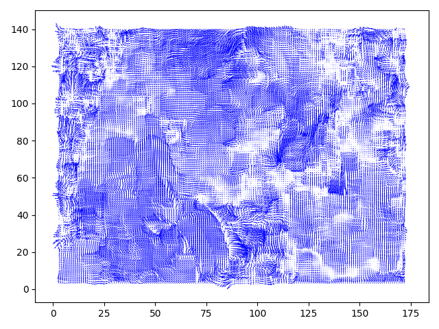

# Lucas & Kanade Optical Flow Algorithm

## Perquisites
- cv2
- numpy
- matplotlib
- skvideo

## Test

- Edit lk_flow_test.py ```frames = read_frames('./videos/suzie_qcif.y4m')``` to your video file path.
- Run lk_flow_test.py to test algorithm.

## Example output

